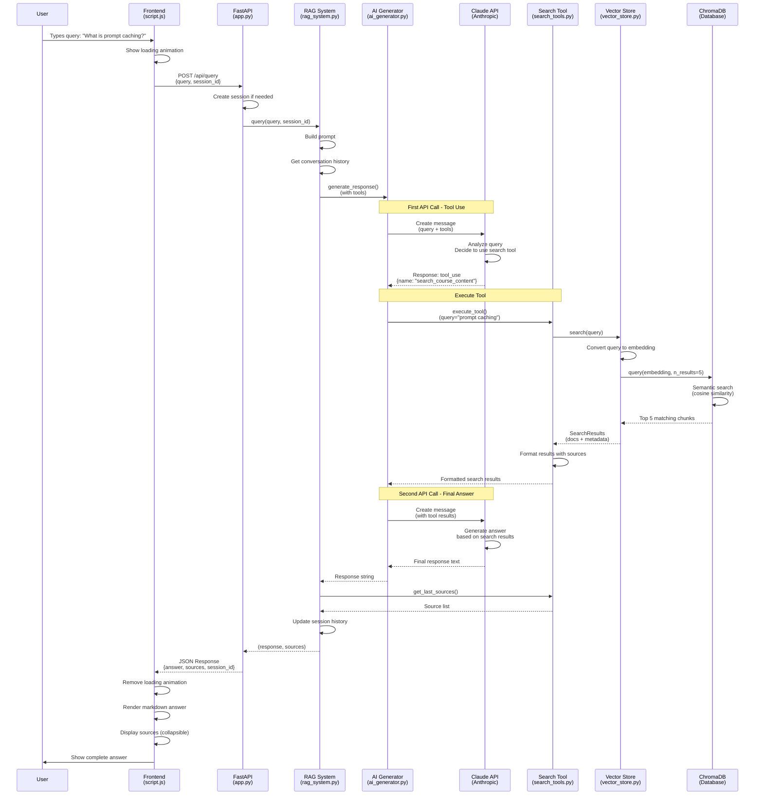
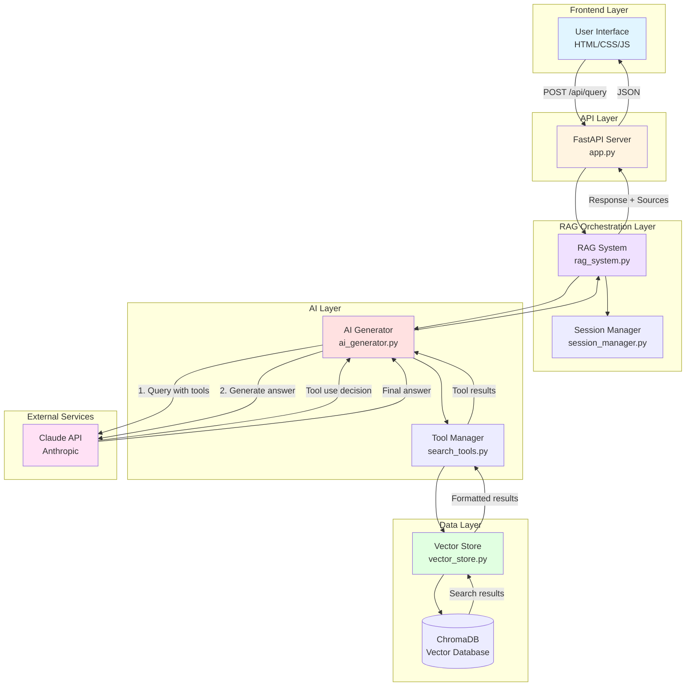
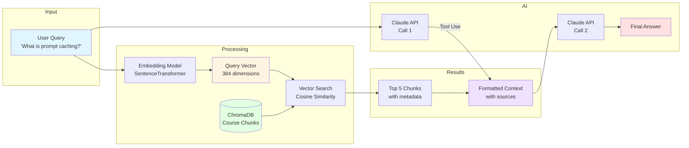

# Complete Query Flow: Frontend → Backend → Response

This document traces a user query (e.g., "What is prompt caching?") through the entire RAG chatbot system.

## Visual Flow Diagram



## Simplified Architecture Diagram



## Data Flow Diagram



---

## **FRONTEND: User Input** (script.js)

### 1. User Types & Sends Message (script.js:45-96)

```javascript
async function sendMessage() {
    const query = chatInput.value.trim();
    // Add user message to chat UI
    addMessage(query, 'user');

    // Show loading animation
    const loadingMessage = createLoadingMessage();

    // Send POST request to backend
    const response = await fetch('/api/query', {
        method: 'POST',
        headers: { 'Content-Type': 'application/json' },
        body: JSON.stringify({
            query: query,
            session_id: currentSessionId  // null for first query
        })
    });
```

**Request sent:**
```json
{
  "query": "What is prompt caching?",
  "session_id": null
}
```

---

## **BACKEND: API Endpoint** (app.py)

### 2. FastAPI Receives Request (app.py:56-74)

```python
@app.post("/api/query", response_model=QueryResponse)
async def query_documents(request: QueryRequest):
    # Create session if not provided
    session_id = request.session_id
    if not session_id:
        session_id = rag_system.session_manager.create_session()

    # Process query using RAG system
    answer, sources = rag_system.query(request.query, session_id)
```

**Session created:** `session_abc123` (example)

---

## **RAG SYSTEM: Query Processing** (rag_system.py)

### 3. RAG System Orchestrates (rag_system.py:102-140)

```python
def query(self, query: str, session_id: Optional[str] = None):
    # Build prompt
    prompt = f"Answer this question about course materials: {query}"

    # Get conversation history (empty for first query)
    history = self.session_manager.get_conversation_history(session_id)

    # Generate response using AI with tools
    response = self.ai_generator.generate_response(
        query=prompt,
        conversation_history=history,
        tools=self.tool_manager.get_tool_definitions(),
        tool_manager=self.tool_manager
    )
```

**Tool definition provided to Claude:**
```python
{
  "name": "search_course_content",
  "description": "Search course materials with smart course name matching...",
  "input_schema": {
    "properties": {
      "query": {"type": "string"},
      "course_name": {"type": "string"},
      "lesson_number": {"type": "integer"}
    }
  }
}
```

---

## **AI GENERATOR: Claude API Call** (ai_generator.py)

### 4. First Claude API Call (ai_generator.py:43-87)

```python
def generate_response(self, query, conversation_history, tools, tool_manager):
    # Build system prompt with history
    system_content = f"{self.SYSTEM_PROMPT}\n\nPrevious conversation:\n{conversation_history}"

    # Prepare API call
    api_params = {
        "model": "claude-sonnet-4-20250514",
        "temperature": 0,
        "max_tokens": 800,
        "messages": [{"role": "user", "content": query}],
        "system": system_content,
        "tools": tools,
        "tool_choice": {"type": "auto"}
    }

    # Call Claude API
    response = self.client.messages.create(**api_params)
```

**System prompt includes:**
> "You are an AI assistant specialized in course materials... Use the search tool **only** for questions about specific course content..."

**Claude's response:** Decides to use the search tool

```json
{
  "stop_reason": "tool_use",
  "content": [
    {
      "type": "tool_use",
      "id": "toolu_abc123",
      "name": "search_course_content",
      "input": {
        "query": "prompt caching"
      }
    }
  ]
}
```

---

## **TOOL EXECUTION: Search Course Content** (search_tools.py)

### 5. Tool Manager Executes Search (ai_generator.py:89-135)

```python
def _handle_tool_execution(self, initial_response, base_params, tool_manager):
    # Execute all tool calls
    for content_block in initial_response.content:
        if content_block.type == "tool_use":
            tool_result = tool_manager.execute_tool(
                content_block.name,      # "search_course_content"
                **content_block.input     # query="prompt caching"
            )
```

### 6. Search Tool Execution (search_tools.py:52-114)

```python
def execute(self, query: str, course_name=None, lesson_number=None):
    # Call vector store search
    results = self.store.search(
        query=query,           # "prompt caching"
        course_name=None,      # No course filter
        lesson_number=None     # No lesson filter
    )

    # Format results
    return self._format_results(results)
```

---

## **VECTOR STORE: Semantic Search** (vector_store.py)

### 7. ChromaDB Semantic Search (vector_store.py:61-100)

```python
def search(self, query, course_name=None, lesson_number=None, limit=None):
    # Resolve course name if provided (skipped here)

    # Build filter (None in this case)
    filter_dict = self._build_filter(None, None)

    # Search course content with embeddings
    results = self.course_content.query(
        query_texts=["prompt caching"],  # Converted to embedding vector
        n_results=5,                      # Max results from config
        where=None                        # No filter
    )

    return SearchResults.from_chroma(results)
```

**What happens:**
1. **Query embedding**: "prompt caching" → `[0.123, -0.456, 0.789, ...]` (384-dimensional vector)
2. **Semantic search**: ChromaDB finds 5 most similar chunks using cosine similarity
3. **Returns**: Chunks from "Building Towards Computer Use with Anthropic" - Lesson about prompt caching

**Search results returned:**
```python
SearchResults(
    documents=[
        "Course Building Towards Computer Use... Lesson 3 content: Prompt caching allows you to...",
        "Course Building Towards Computer Use... Lesson 3 content: The cache has a 5-minute TTL...",
        # ... 3 more chunks
    ],
    metadata=[
        {"course_title": "Building Towards...", "lesson_number": 3, "chunk_index": 45},
        {"course_title": "Building Towards...", "lesson_number": 3, "chunk_index": 46},
        # ...
    ]
)
```

---

### 8. Format Search Results (search_tools.py:88-114)

```python
def _format_results(self, results):
    formatted = []
    sources = []

    for doc, meta in zip(results.documents, results.metadata):
        course_title = meta.get('course_title')
        lesson_num = meta.get('lesson_number')

        # Build header
        header = f"[{course_title} - Lesson {lesson_num}]"

        # Track source
        sources.append(f"{course_title} - Lesson {lesson_num}")

        formatted.append(f"{header}\n{doc}")

    # Store sources for later retrieval
    self.last_sources = sources

    return "\n\n".join(formatted)
```

**Tool result returned to Claude:**
```
[Building Towards Computer Use with Anthropic - Lesson 3]
Prompt caching allows you to cache frequently used content...

[Building Towards Computer Use with Anthropic - Lesson 3]
The cache has a 5-minute TTL and can reduce costs significantly...
```

---

## **AI GENERATOR: Second Claude API Call** (ai_generator.py)

### 9. Send Tool Results Back to Claude (ai_generator.py:122-135)

```python
# Build message history with tool use
messages = [
    {"role": "user", "content": "Answer this question: What is prompt caching?"},
    {"role": "assistant", "content": initial_response.content},  # Tool use
    {"role": "user", "content": [
        {
            "type": "tool_result",
            "tool_use_id": "toolu_abc123",
            "content": "[Building...]\nPrompt caching allows..."
        }
    ]}
]

# Get final response (without tools this time)
final_response = self.client.messages.create(
    model="claude-sonnet-4-20250514",
    messages=messages,
    system=system_content
)

return final_response.content[0].text
```

**Claude's final response:**
```
Prompt caching allows you to cache frequently used content in your API requests,
such as system prompts or large context. This reduces latency and costs by
avoiding re-processing the same content. The cache has a 5-minute TTL and can
significantly reduce costs for repeated requests with the same context.
```

---

## **RAG SYSTEM: Collect Sources** (rag_system.py)

### 10. Retrieve Sources from Tool (rag_system.py:129-140)

```python
# Get sources from the search tool
sources = self.tool_manager.get_last_sources()
# Returns: ["Building Towards Computer Use... - Lesson 3", ...]

# Reset sources after retrieving
self.tool_manager.reset_sources()

# Update conversation history
self.session_manager.add_exchange(session_id, query, response)

return response, sources
```

---

## **BACKEND: Return Response** (app.py)

### 11. FastAPI Sends Response (app.py:68-72)

```python
return QueryResponse(
    answer=answer,
    sources=sources,
    session_id=session_id
)
```

**HTTP Response:**
```json
{
  "answer": "Prompt caching allows you to cache frequently used content...",
  "sources": [
    "Building Towards Computer Use with Anthropic - Lesson 3",
    "Building Towards Computer Use with Anthropic - Lesson 3"
  ],
  "session_id": "session_abc123"
}
```

---

## **FRONTEND: Display Response** (script.js)

### 12. Render Response in UI (script.js:76-86)

```javascript
const data = await response.json();

// Update session ID
currentSessionId = data.session_id;

// Remove loading message
loadingMessage.remove();

// Add assistant message with sources
addMessage(data.answer, 'assistant', data.sources);
```

### 13. Format with Markdown (script.js:113-138)

```javascript
function addMessage(content, type, sources) {
    // Convert markdown to HTML
    const displayContent = marked.parse(content);

    let html = `<div class="message-content">${displayContent}</div>`;

    // Add collapsible sources
    if (sources && sources.length > 0) {
        html += `
            <details class="sources-collapsible">
                <summary>Sources</summary>
                <div class="sources-content">${sources.join(', ')}</div>
            </details>
        `;
    }

    messageDiv.innerHTML = html;
    chatMessages.appendChild(messageDiv);
}
```

---

## Summary: Key Components in Flow

| Step | Component | File | Key Action |
|------|-----------|------|------------|
| 1 | Frontend | script.js:45 | User types query, sends POST request |
| 2 | API Endpoint | app.py:56 | Receives request, creates session |
| 3 | RAG System | rag_system.py:102 | Orchestrates query processing |
| 4 | AI Generator | ai_generator.py:43 | First Claude API call (tool use) |
| 5 | Tool Manager | search_tools.py:52 | Executes search tool |
| 6 | Vector Store | vector_store.py:61 | Semantic search in ChromaDB |
| 7 | Search Tool | search_tools.py:88 | Formats results with sources |
| 8 | AI Generator | ai_generator.py:122 | Second Claude API call (final answer) |
| 9 | RAG System | rag_system.py:129 | Collects sources, updates history |
| 10 | API Endpoint | app.py:68 | Returns JSON response |
| 11 | Frontend | script.js:76 | Renders markdown answer + sources |

**Total time:** ~2-3 seconds for the complete round trip.

## Key Insights

1. **Tool-Based Approach**: Claude decides when to search, making it more intelligent than traditional RAG
2. **Semantic Search**: Uses vector embeddings for similarity matching, not just keyword search
3. **Two API Calls**: First to decide tool use, second to generate final answer
4. **Source Tracking**: Sources flow from vector store → search tool → RAG system → frontend
5. **Session Management**: Conversation history maintained for context-aware responses
6. **Chunking Strategy**: Documents split into 800-char chunks with 100-char overlap for context preservation
